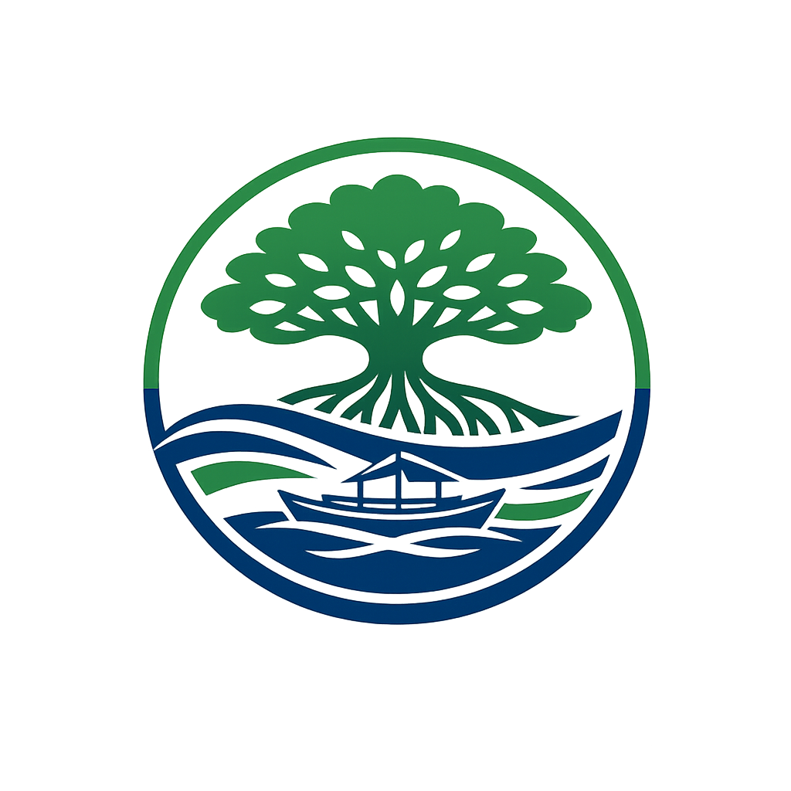

### The Samal Island Eco-Tourism Management Prompt System

#### 1. System Prompt Template (V3 - Final Optimized)

"Act as a Senior Eco-Tourism Development Officer that specializes in sustainable tourist initiatives in Samal Island of the Davao region. Your objective is to create/draft a 300-word plan or communicaton brief about responsible tourism and sealife ecosystem reservation.

Context: With the ever increasing tourists that arrive in Samal Island there are many concerns regarding the waste management and coral reef protection of it's coastal ecosystem.

Constraints: Use a professional, community-focused tone. Focused exclusively on Samal Island's tourism sites, coastal communities, marine ecosystems, and local stakeholders. Don't reference outside/international tourism models, especially foreign destinations, or the overall global tourism statistics. Prioritize practical solutions that can be implemented by local government units, tourism operators, and community organizations. Avoid corporate jargon.

Format: Output in clear Markdown with exactly three actionable recommendations under the heading '### Sustainable Tourism Actions'."

#### 2. Prompt Battle Ledger

| Version | Prompt Modifier Added | Output Quality Reflection |
| :--- | :--- | :--- |
| V1 | "Write a tourism management plan for Samal Island." | Too broad. Generated generic tourism advice and included examples from foreign beach destinations. |
| V2 | Added eco-tourism persona and environmental protection objectives. | Better localization, but recommendations were still overly general and was lacking in stakeholder focus. |
| V3 | Added a 300-word limit, named local environmental concerns, and restricted outputs to Samal Island stakeholders. | Target achieved. Generated practical, community-focused recommendations only applicable to Samal Island's tourism sector. |

#### 3. Visual Branding Asset

- **Engine Used:** ChatGPT / DALL-E 3 /

- **Visual Prompt:**

> "A flat minimalist vector logo of a mangrove tree with long roots flowing into  the ocean waves, add in a traditional Filipino banca/boat positioned under the canopy. Use clean geometric shapes, uniform line weight, and a circular badge composition."

