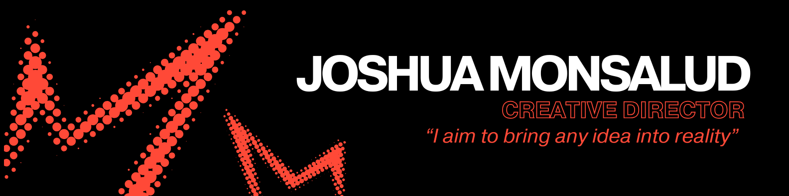

# Joshua Monsalud

### Creative Director | Designer | Developer

*"I aim to bring any idea into reality”"*

---

## About Me

I am a creative director who transforms ideas into meaningful visual experiences through design, storytelling, and digital media. My journey started with a passion for drawing and illustration leading me to develop projects that combine branding, web development, and multimedia design into one cohesive vision. From building identities for brands like Casa Felina to developing user-centered concepts such as Rentwise, I focus on creating designs that are not only visually compelling but also purposeful and engaging.

---

## Branding 

](branding/Joshua_Monsalud-_C.R.A.P.pdf)

This project focused on creating a minimalist luxury identity for Casa Felina. I selected a warm neutral palette and simple architectural iconography to communicate comfort, relaxation, and sophistication.

## Docs

This project focused on creating a minimalist luxury identity for Casa Felina. I selected a warm neutral palette and simple architectural iconography to communicate comfort, relaxation, and sophistication.

## Media

This project focused on creating a minimalist luxury identity for Casa Felina. I selected a warm neutral palette and simple architectural iconography to communicate comfort, relaxation, and sophistication.

This project focused on creating a minimalist luxury identity for Casa Felina. I selected a warm neutral palette and simple architectural iconography to communicate comfort, relaxation, and sophistication.

## Visuals

This project focused on creating a minimalist luxury identity for Casa Felina. I selected a warm neutral palette and simple architectural iconography to communicate comfort, relaxation, and sophistication.

This project focused on creating a minimalist luxury identity for Casa Felina. I selected a warm neutral palette and simple architectural iconography to communicate comfort, relaxation, and sophistication.
