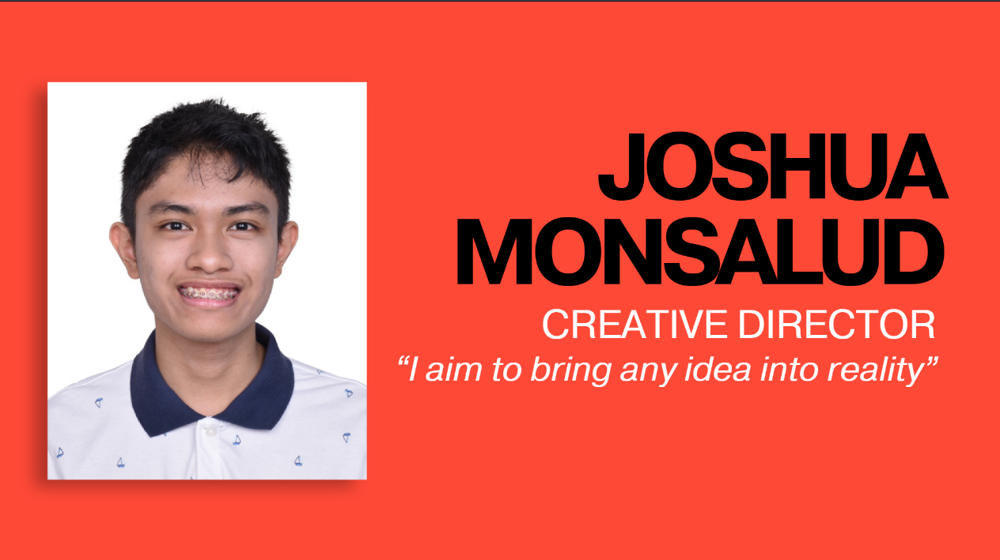
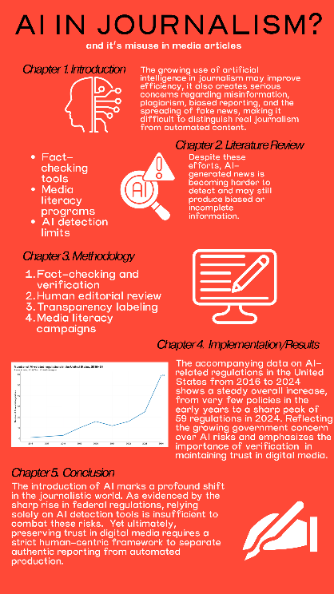
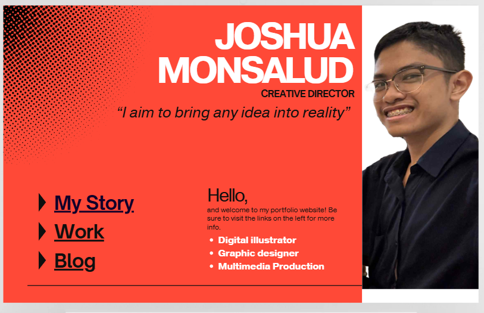
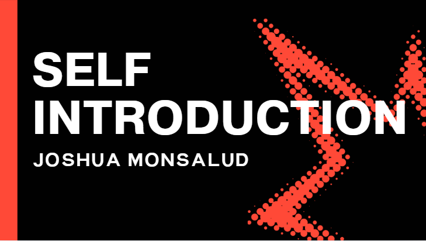
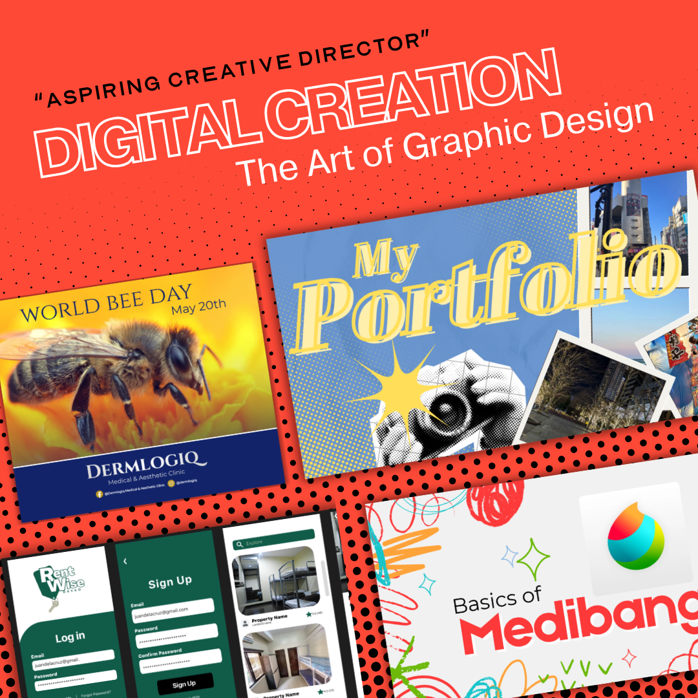

# Joshua Monsalud

### Creative Director | Designer | Developer

*"I aim to bring any idea into reality”"*

---

## About Me

I am a creative director who transforms ideas into meaningful visual experiences through design, storytelling, and digital media. My journey started with a passion for drawing and illustration leading me to develop projects that combine branding, web development, and multimedia design into one cohesive vision. From building identities for brands like Casa Felina to developing user-centered concepts such as Rentwise, I focus on creating designs that are not only visually compelling but also purposeful and engaging.

---

## Branding 

My branding has 3 simple yet striking colors, consisting of red, white, and black. To not only visually interest clients but strike a very professional yet stylistic impression.

## Docs

This project took a minimalistic approach but that's due to me wanting viewers to fully pay attention to the topic which is: AI in Journalism. Discussing it's impact and what we can do against it.

## Media

This serves as another portfolio site that uses a minimalistic approach. Using the canva features I was able to create a MOCKUP site dedicated to my branding. Using the same branding visuals to keep it consistent.

Minimal in editing but hopefully I was able to effectively deliver what you could possibly learn from me and my work. 30 seconds in total is enough time to be able to get to know me.

## Visuals

Simple and striking like I always intended. Especially with the half tones.

Lastly here's more of my portfolio work. Introducing what I can do to help create your visuals more effectively.
